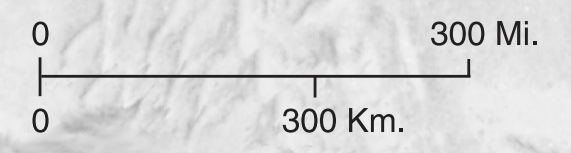

# Map Parsing

The [map translation tool](https://crowd.rocks/US/en/1/maps/list) on crowd.rocks only works on specially processed `.svg` files. To designate the special processing we do on these maps, we change the file suffix to `.cf.svg`, which stands for "crowd friendly svg" file.  

In order to map a 'normal' svg map crowd-friendly, there are a few changes that need to be made:  
1. All translatable strings need to be in leaf nodes.  
1. Visual placement of strings on the map need to accommodate an increase in string size in the appropriate direction of expansion.  
1. Abbreviations of any kind need to be expanded so translators know what they are.  

## Translatable Strings in Leaf Nodes

The map parser has been kept to be as simple as possible, since there are too many ways any given tool may choose to construct an svg document. It would be too difficult to accommodate every possible svg file.   

The current svg parser only creates a translatable string from leaf nodes, and will never combine two or more leaf nodes to create a translatable string. The current leaf nodes it looks for are `<text>` and `<tspan>`. If a `<text>` node has children, any string content in that node will be ignored.   

Consider the following non-crowd-friendly snippet:  
```xml
  <g id="Labels">
    <text class="cls-34" transform="translate(280.75 220.48)">
      <tspan class="cls-25" x="0" y="0">R</tspan>
      <tspan x="3.25" y="0">ome</tspan>
    </text>
    <text class="cls-34" transform="translate(408.85 281.43)">
      <tspan class="cls-17" x="0" y="0">A</tspan>
      <text class="cls-57" x="3.61" y="0">th ens</text>
    </text>
  </g>
```

The parser will create a translatable string for `R`, `ome`, `A`, and `th ens`. Four strings in total. Only one of these is useful (`A`).   

After post-processing, the crowd-friendly version of this will be:  
```xml
  <g id="Labels">
    <text class="cls-34" transform="translate(280.75 220.48)">
      Rome
    </text>
    <text class="cls-34" transform="translate(408.85 281.43)">
      Athens
    </text>
  </g>
```
Now each translatable string is in a leaf node, and no two nodes need to be combined to create a useful string. This applies equally to `<text>` and `<tspan>` elements.  

## Visual Placement of Strings

Translations will often take up more space than the original text. String placement on a map needs to account for this. Consider this dense region in a map:  

  

Change the placement and size of text strings will help ensure the translated strings don't run into each other. Here is a crowd-friendly version:  

    

An important method for ensuring the translated text expands in the correct direction is to use the `text-anchor` attribute to control which side or sides of the string the translated text will expand to.  

  

If the `text-anchor` is at the `start` the translation will expand to the right, in LTR contexts, left, in RTL contexts. `middle` will cause it to expand in both directions. `end` is the opposite of `start`.  


## Remove Abbreviations

It may be helpful to expand or explain any abbreviations, jargon, nomenclature, slang, etc from maps so that translators have an easier time understanding context.   

In this example, we have `Mi.`:  
  
It may be helpful to just write out the full word:  

